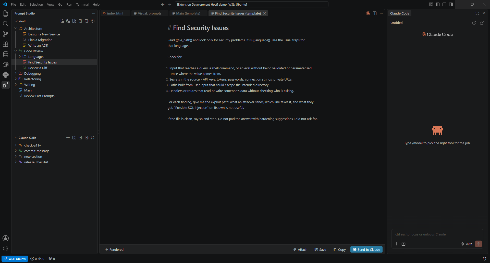
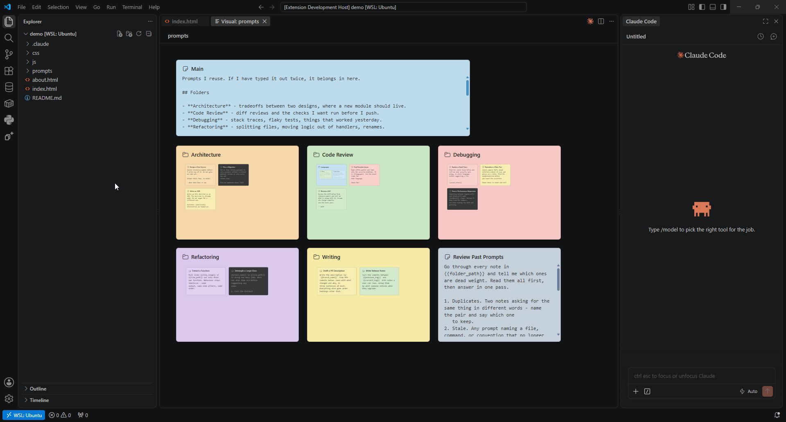

# VSCode Prompt Studio

An Obsidian-like storage solution for your prompt collection, with live markdown editor and Claude integrations.

   

*Custom sidebar on the left, live md editor in center, claude on the right.*

<b>Sticky Notes Mode</b>

*Prompts viewed as separate notes, like having a bunch of notepad.exes open*

---

Store and manage your project prompt collections in one place.

Write your prompts in a live markdown viewer, and store them as plain md files on your disk (stored anywhere, even inside your project folder).

Auto-detect project and sub-project skill files easily view/edit them alongside your prompts.

## Features

- **Canvas view** Explore your prompt collection as an infinite canvas. Zoom into a folder to open it, and type straight into the cards while **Edit** is on in the bottom bar.
- **Live markdown editor** or just plain txt.
- **Send directly to Claude** Send your prompts straight to claude, including media attachments.
- **Skills management** All `.claude/skills` folders in the workspace and its sub-projects, browsable and editable in the live editor.
- **Enhanced `@` browsing.** A filesystem cache is held meaning that `@` file links resolve immediately, instead of long loading on Claude.
- **A vault per project, or one shared by all.** A title-bar button swaps both sidebars to the global vault and your own `~/.claude/skills`.

## Install

Search for **Prompt Studio** in the Extensions view, or install it from the [marketplace listing](https://marketplace.visualstudio.com/items?itemName=Ge0rg3.prompt-studio).

## Requirements

- VSCode 1.85 or newer.
- **Optional** | The [Claude Code extension](https://marketplace.visualstudio.com/items?itemName=anthropic.claude-code), for the **Send to Claude** actions (you can still copy to clipboard).
- **Optional** | On Linux, `wl-copy` or `xclip`, so a note's images can be attached to what you send (if uninstalled, the filepath is pasted into the prompt instead).

## Settings

Press the gear icon in your studio to open the settings tab (or select **Prompt Studio: Settings** in the palette).

Current settings:
- **Default note view** (`promptStudio.defaultNoteView`): Whether to use the built-in Markdown template editor, or just use default editor.
- **Project vault location**: Where this project's collection is stored on disk (can be within the project itself). Defaults to a location in the extension files.
- **Global vault location** (`promptStudio.globalVaultLocation`): Where the collection shared by every project is stored on disk. Defaults to a location in the extension files.

## Contributing

Build instructions and the repository layout are in [CONTRIBUTING.md](CONTRIBUTING.md).

## Third-party notices

This extension uses the following projects, with thanks:

| Component | Copyright | License |
|-----------|-----------|---------|
| [CodeMirror 6](https://codemirror.net) | Marijn Haverbeke and contributors | MIT |
| [Lezer](https://lezer.codemirror.net) | Marijn Haverbeke and contributors | MIT |
| crelt, style-mod, w3c-keyname, find-cluster-break | Marijn Haverbeke | MIT |
| [VSCode codicons](https://github.com/microsoft/vscode-codicons) | Microsoft Corporation | CC-BY-4.0 |
| [yaml](https://eemeli.org/yaml/) | Eemeli Aro | ISC |

## License

VSCode Prompt Studio is released under the GNU General Public License v3.0. See [LICENSE](LICENSE) for the full text.
